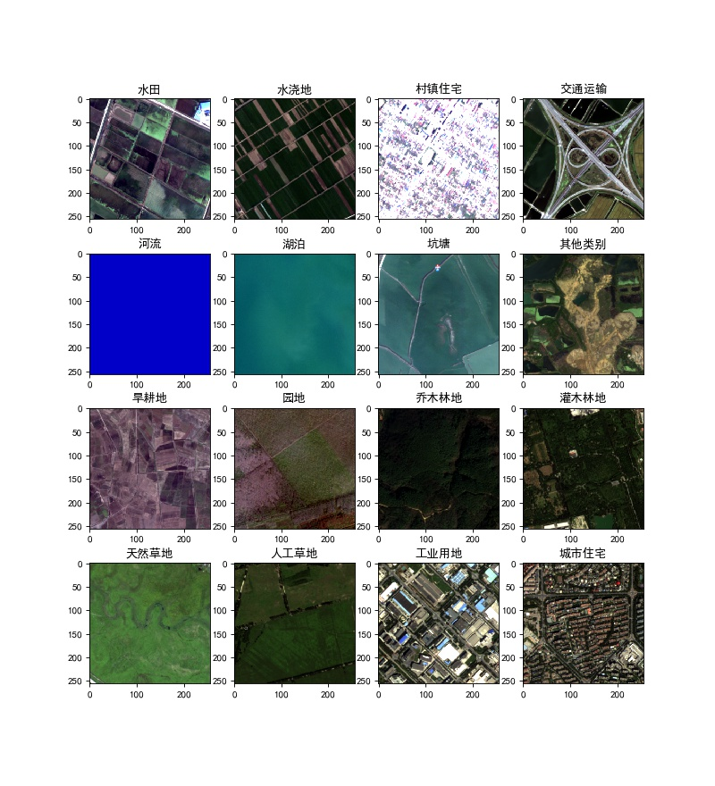

# High-Resolution-Remote-Sensing-Semantic-Segmentation-PyTorch
## 待完善……感谢关注，Star or Fork

## Update soon：
   - [ ] 完善（膨胀）预测代码
   - [ ] 加入后处理方法
   - [ ] 引入半监督方法：伪标签
   - [ ] 增加数据增强方法：MixUp、Crop_and_Patch
   - [x] 加入tensorboardX可视化输出
   - [ ] 类别不均衡解决办法：focal loss
   - [ ] 引入辅助loss：边缘损失、KL散度、向量场损失

## TODO:
   - [ ] 完善网络模型(将支持：DeepLabV3, FPN, SegNet, UNet)
   - [ ] 总结训练步骤、技巧
   - [ ] 分享预训练模型

## 使用TensorBoard查看各项指标以及可视化（img, GT, Pre）
   - 本地：
   
    tensorboard --logdir=<your_log_dir>
   - 服务器：
    
    #首先使用ssh登陆服务器并转发端口:
    ssh -L 6006:127.0.0.1:6006 远程服务器用户名@远程服务器Ip
    (ssh -L 本地端口:本地IP:远程端口 远程服务器用户名@远程服务器Ip)
    
    #在服务器上运行tensorboard:
    tensorboard --logdir=<your_log_dir>
    
    #在浏览器里输入:
    远程服务器Ip:6006
   - 各项指标样例
   
   
   
   - 可视化测试集样例（img, GT, Pre）
   
   

    
   
## 数据分享

- **场景分类**
    ##### 2019年遥感图像稀疏表征智能分析竞赛
    百度网盘 链接:https://pan.baidu.com/s/1NFvL8KV4pRwumBah05GG8A  密码:x5k0
    
- **变化检测**

- **语义分割**
    ##### [2019年县域农业大脑AI挑战赛](https://tianchi.aliyun.com/competition/entrance/231717/information)
    百度网盘 链接:https://pan.baidu.com/s/1VXMLTCZM10quebX6Wf169w  密码:cmt7
    ##### 2019年遥感图像稀疏表征智能分析竞赛
    百度网盘 链接:https://pan.baidu.com/s/1LiMjwotcnQus0HFntEiZog  密码:3obz
    ##### [GID](https://arxiv.org/abs/1807.05713)
    [官方下载链接](https://x-ytong.github.io/project/GID.html)
    
    百度网盘 链接:https://pan.baidu.com/s/1LM6WX6zgihzIlY5OJWGEFA  密码:n8n0
    
    - 数据集信息
    
        
        
        
    
    - 样例展示
        

## Reference

    https://github.com/kazuto1011/deeplab-pytorch
    https://github.com/fregu856/deeplabv3
    https://github.com/zijundeng/pytorch-semantic-segmentation

## Contact
    
    author: hk
    qq：3025531252
    email: 3025531252@qq.com