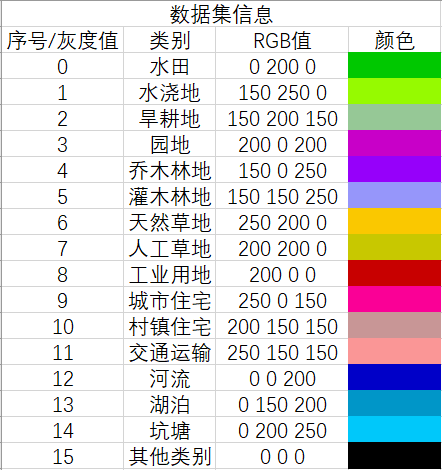

# High-Resolution-Remote-Sensing-Semantic-Segmentation-PyTorch
## 待完善……

## 数据分享

- **场景分类**
    ##### 2019年遥感图像稀疏表征智能分析竞赛
    链接:https://pan.baidu.com/s/1NFvL8KV4pRwumBah05GG8A  密码:x5k0

- **语义分割**
    ##### [2019年县域农业大脑AI挑战赛](https://tianchi.aliyun.com/competition/entrance/231717/information)
    coming soon!
    ##### 2019年遥感图像稀疏表征智能分析竞赛
    coming soon!
    ##### [GID](https://arxiv.org/abs/1807.05713)
    - 数据集信息
    
        
    
    - 样例展示
        
    
    coming soon!

## Contact
    
    author: hk
    
    email: 3025531252@qq.com